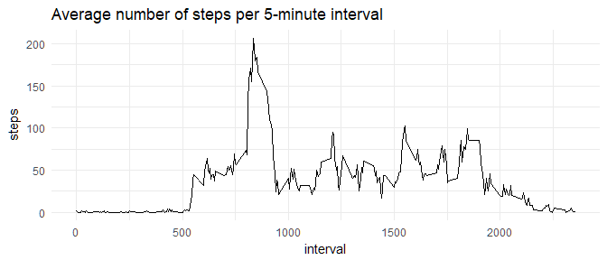

## Loading packages

Let's load tidyverse and lubridate for data transformation, visualisation and time processing.


```r
if (!require(tidyverse)) {
      install.packages("tidyverse")
      library(tidyverse)
}
if (!require(lubridate)) {
      install.packages("lubridate")
      library(lubridate)
}
```


## Loading and preprocessing the data

We unzip the provided archive file, read in the comma-separated value file as a tibble and parse the date column.


```r
unzip("activity.zip")
dat <- as.tibble(read.csv("activity.csv")) %>%
    mutate(date=ymd(date))
```


## What is the mean total number of steps taken per day?

First, we sum up the steps data grouped by date:


```r
steps_day <- dat %>%
    group_by(date) %>%
    summarise(steps=sum(steps))
```

Then we plot a histogram of the total number of steps taken per day:


```r
ggplot(steps_day, aes(x=steps)) + 
    geom_histogram(bins=20) +
    ggtitle("Total number of steps taken per day") +
    theme_minimal()
```

<!-- -->

We calculate the mean and median of steps taken per day:


```r
mean_steps_day <- mean(steps_day$steps, na.rm=TRUE)
median_steps_day <- median(steps_day$steps, na.rm=TRUE)
```

The **median** total number of steps taken per day is **10,765**. 
At **10,766.19**, the **mean** is very close to the median. This is an indication of a rather symmetrical distribution of the values.


## What is the average daily activity pattern?

We calculate the average number of steps taken per 5-minute interval:


```r
mean_steps_interval <- dat %>%
    group_by(interval) %>%
    summarise(steps=mean(steps, na.rm=TRUE))
```

We plot the average number of steps per interval as a time series:


```r
ggplot(mean_steps_interval, aes(x=interval, y=steps)) +
    geom_line() +
    ggtitle("Average number of steps per 5-minute interval") +
    theme_minimal()
```

<!-- -->

Which 5-minute interval, on average across all the days in the dataset, contains the maximum number of steps?


```r
max_steps_interval <- mean_steps_interval %>%
    filter(steps == max(steps)) %>% 
    select(interval, steps) %>%
    print()
```

```
## # A tibble: 1 x 2
##   interval    steps
##      <int>    <dbl>
## 1      835 206.1698
```

The interval 835 contains the maximum number of steps (206) on the average. Averaged across all days, activity peaks in the morning.

## Imputing missing values

Let's see how many missing values there are in each column of the dataset:


```r
count_na <- dat %>%
    summarise_all(funs(sum(is.na(.)))) %>%
    print()
```

```
## # A tibble: 1 x 3
##   steps  date interval
##   <int> <int>    <int>
## 1  2304     0        0
```

Only the steps variable has missing values. There are 2,304 missing value rows in the dataset. This corresponds to 13.11% of the observations.  

As the number of steps taken seems to depend largely on the time of the day, we impute missing values by using the mean value for the specific interval across all days:


```r
dat <- dat %>%
    group_by(interval) %>% 
    mutate(steps = ifelse(is.na(steps), mean(steps, na.rm = TRUE), steps))
```

Now we make a histogram of the total number of steps taken per day **based on the dataset with imputed data**:


```r
steps_day <- dat %>%
    group_by(date) %>%
    summarise(steps=sum(steps))

ggplot(steps_day, aes(x=steps)) + 
    geom_histogram(bins=20) +
    ggtitle("Total number of steps taken per day (imputed missing values)") +
    theme_minimal()
```

<!-- -->

Then we calculate the mean and median of steps taken per day **based on the dataset with imputed data**.


```r
mean_steps_day <- mean(steps_day$steps, na.rm=TRUE)
median_steps_day <- median(steps_day$steps, na.rm=TRUE)
```

The **median** total number of steps taken per day now is **10,766.19**, and the **mean** is **10,766.19**.  As we have used a mean value for imputation, the mean has not changed, and the median has moved towards the mean.


## Are there differences in activity patterns between weekdays and weekends?

We create a new factor variable in the dataset with two levels -- "weekday" and "weekend":


```r
dat <- dat %>%
    mutate(type=as.factor(ifelse(wday(date)==1 | wday(date)==7, "weekend", "weekday"))) 
```

Let's plot the average number of steps taken per interval for weekdays and weekend:


```r
mean_steps_interval <- dat %>%
    group_by(interval, type) %>%
    summarise(steps=mean(steps, na.rm=TRUE))

ggplot(mean_steps_interval, aes(x=interval, y=steps)) +
    geom_line() +
    ggtitle("Average number of steps per 5-minute interval") +
    facet_grid(type~.) +
    theme_minimal()
```

<!-- -->
  
It seems that in the weekend, there is less activty in the morning, but more activity around noon and in the evening than on weekdays.
